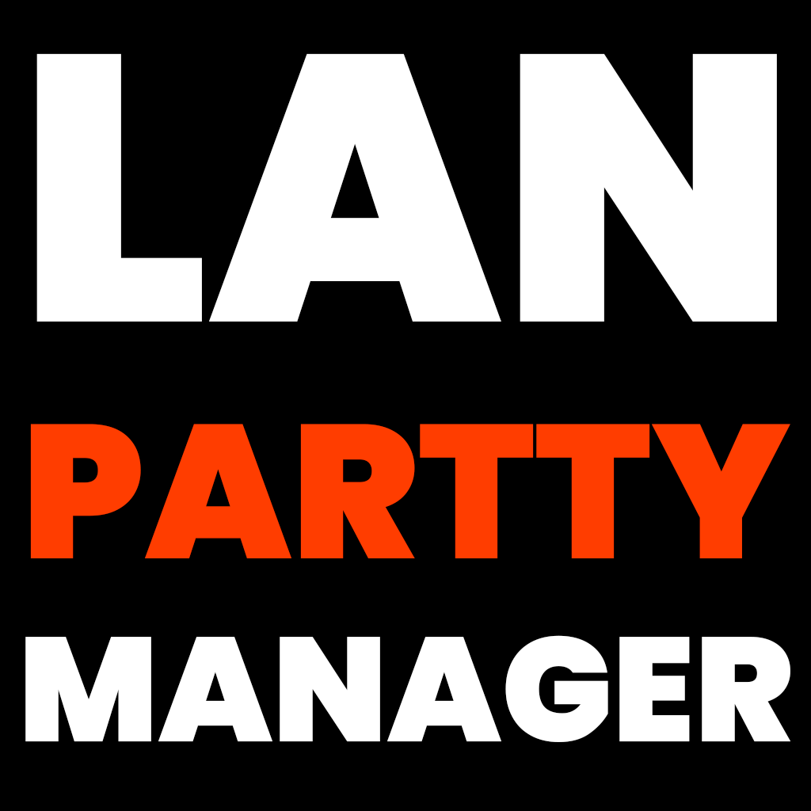

<div align="center">



# LAN Party Manager

**The self-hosted HQ for your LAN party weekends.**
Invites, brackets, shared costs, photos, big-screen hype — on a box you own.

[](#)
[](LICENSE)
[-555?style=flat-square)](#)
[](https://hub.docker.com/r/crosswax/lanpartymanager-backend)
[](#)

[Website](https://lanpartymanager.com) · [Docker Hub](https://hub.docker.com/r/crosswax/lanpartymanager-backend) · [Desktop app](https://lanpartymanager.com/#desktop) · [Full technical docs](docs/README.md) · [Version française](README_FR.md)

</div>

---

## The origin story

We've been throwing LAN parties **since 2015**. Somewhere along the way, organizing them
turned into a second job: a spreadsheet for the money, a Discord thread for the RSVPs, a
whiteboard for the bracket, and someone's phone holding all the photos hostage.

We were playing **Spreadsheet Simulator** more than we were playing games.

LPM fixes that. One app, on your own machine, that follows the whole weekend: who's coming
and when, who owes what, who won, who brought the projector, and which photo of the pizza
got the most 🔥. **No cloud, no account with anyone, no telemetry, no subscription.** Your
crew's chaos stays on your box.

## What's in the box

| | |
|---|---|
| 🎟️ **Invites & RSVP** | Per-event invite codes (QR-shareable, revocable). Arrival/departure dates feed everything else. |
| 🏆 **Tournaments** | Single-elim brackets & round-robins, team or solo, for any game. Scores in, standings out, champion on the big screen. |
| 💸 **Treasury** | Pro-rata cost splitting by *nights actually stayed*. The "who owes what" argument, retired forever. |
| 📸 **Media vault** | Shared photo/video gallery with emoji reactions and video thumbnails. |
| 📺 **Big-screen kiosk** | A token-authorized projector page: live matches, arrivals, photo wall, trophy ceremonies with confetti. |
| 🗓️ **Planning** | Propose time blocks, vote, lock the schedule. The projector counts down to the next one. |
| 🎮 **The rest** | Twitch embeds, Discord SSO & announcements, gear checklist ("who brings the switch?"), groceries, trophies, post-event recap… **29 features**, each one switchable off. |

Bilingual **EN/FR**, per player. Full tour on the [website](https://lanpartymanager.com).

## Get it running (~10 minutes)

You need [Docker](https://docs.docker.com/get-docker/). A laptop, a spare PC or a
**Raspberry Pi 4/5** is plenty — images ship for amd64 and arm64.

### Option A — Docker Compose

```bash
mkdir lanpartymanager && cd lanpartymanager
echo "SECRET_KEY=change-me-to-a-long-random-string" > .env
```

Create `docker-compose.yml`:

```yaml
services:
  backend:
    image: crosswax/lanpartymanager-backend:latest
    # No ports: — the frontend's Nginx reaches it over the Docker network.
    volumes:
      - ./data:/app/data        # SQLite database (persisted)
      - ./uploads:/app/uploads  # Avatars, media, video thumbnails (persisted)
    environment:
      SECRET_KEY: ${SECRET_KEY}
      DATABASE_URL: sqlite:///./data/lanparty.db
      UPLOAD_DIR: /app/uploads
    restart: unless-stopped

  frontend:
    image: crosswax/lanpartymanager-frontend:latest
    ports:
      - "3001:80"
    environment:
      # Where your reverse proxy (Nginx Proxy Manager, Caddy…) connects from.
      # The default covers a proxy running in Docker on the same host.
      LPM_TRUSTED_PROXIES: "172.16.0.0/12"
    volumes:
      - ./uploads:/app/uploads  # Nginx serves uploads directly
    depends_on:
      - backend
    restart: unless-stopped
```

```bash
docker compose up -d
```

Open **http://localhost:3001** — GG, you're live.

### Option B — Portainer stack

Paste the same YAML as a Portainer stack, with **one crucial change**: replace
`${SECRET_KEY}` with a literal long random string. Portainer silently resolves
`${VAR:-default}` to an *empty* value, the backend refuses to start, and the resulting
nginx 502 looks exactly like "login is broken". Ask us how we know.

### First login

The **first account created becomes admin**. Everyone after that joins with an invite
code you generate per event — share it as a QR, revoke it anytime. Backups (database +
uploads) are one click in Settings, restore too.

## Desktop app (Windows) 🖥️

For crews who'd rather not keep a browser tab open: a native tray client that wraps
**your** instance — same login, same everything.

- Point it at your server's URL once, like picking a Slack workspace.
- Native toasts for matches, announcements and trophies. Click one, land on the page.
- Automatic **League of Legends** stats captured during the LAN.
- Auto-updates itself between editions.

**[Download the installer →](https://lanpartymanager.com/#desktop)** (Windows 10/11, x64, .msi)

## Going deeper 🤿

The full technical documentation — configuration, API reference, roles & permissions,
the pro-rata math, troubleshooting, project structure — lives in
**[docs/README.md](docs/README.md)**.

Spicier questions ("Why SQLite?", "Smells vibecoded?", "Root access, why the F?") get
straight answers in the **[website FAQ](https://lanpartymanager.com/#faq)**.

## License

**AGPL-3.0** — see [LICENSE](LICENSE). Versions up to 1.3.2 were GPL-2.0; the move to
AGPL-3.0 starts with 1.3.3. Run it, fork it, improve it — if you serve a modified
version to your crew, share the changes. That's the deal.

---

<div align="center">

Made by **[CrossWax](https://www.crosswax.net)** with a crew of LAN regulars — built for
our own weekends first, sped up immensely by [Claude Code](https://claude.com/claude-code)
since July 2026. **Now go frag, the spreadsheet is handled.**

</div>
